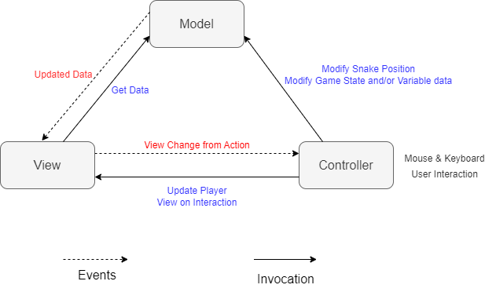
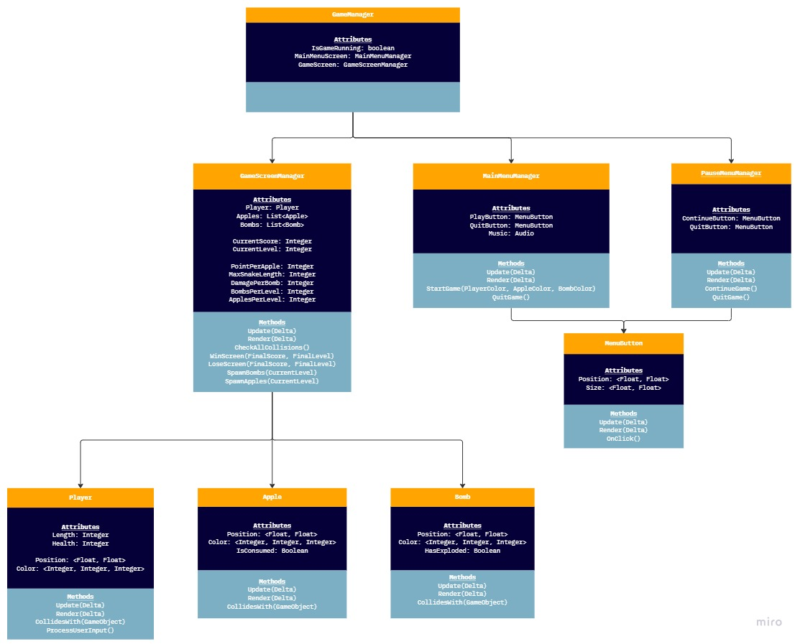

# CP 411 - Project Proposal

Nausher Rao - 190906250

Chandler Mayberry - 190688910

Connor Logan - 190209360

---

## Introduction

Snake is a very famous and common video game that people have played since the beginning of technology. We’re going to be creating create a simple 2D top-down snake game containing the main menu, score points, win states, and failure states. The win state occurs when the player collects enough apples to create a snake the size of the window and the failure state occurs when the snake hits a bomb. The main problems we’ll have to solve are:

- Getting and processing user control through the keyboard allows the user to control the snake character.
- Getting and processing user input through the mouse to allow moving between the main menu and the game.
- Implementing object collision between the player (snake), bombs, and apples.
- Storing and retrieving scores from different players.
- The user interfaces are in the form of a menu system (resume and quit).
- The ability to choose the colour of the snake, apples, and bombs.
- The ability to resize the viewport depending on the size of the window size.

## Problem-solving and algorithms

- Collision detection requires constant checking of the character's position with its surrounding objects’ positions. This algorithm at most will be $O(n)$ as each object has two coordinates, $x$ and $y$, that will be checked against the other objects. This algorithm will have minimal effect on performance.
- We need to implement an algorithm that dictates the generation of apples and bombs so that they aren’t in the same position, aren’t colliding with other objects, and are visible on the screen to the player. This algorithm would only run at the beginning of every round and would have minimal effect on performance.
- We’ll need an algorithm that ensures that the snake can’t grow after a certain size. This will trigger the win state, and effectively be the end of the game. This algorithm will also have minimal effect on performance.

## Design consideration

### MVC Model

- **Model** - Contains game logic and game state data including snake position, win & lose conditions, and position locations of apples/bombs.
- **View** - Displays essential model data to the user in 2D graphics including the snake renderer, apples/bombs renderer, object colours, and game space.
- **Controller** - Contains simple methods for user mouse interaction in menus and w, a, s, d for player snake control in 4 directions (forward, left, down, right).

_Note: Although methods are abstracted from the above model in the UML diagram, workflow organization will keep the MVC model in scope for design structure and milestone completion._

### UML Diagram

## Milestones & Schedule

### Milestones and Schedule

| Task | Description        | Due Date |
| ---- | ------------------ | -------- |
| 1    | Project Research   | 28/11/22 |
| 2    | Project Proposal   | 29/11/22 |
| 3    | Project Checkpoint | 04/11/22 |
| 4    | Project Submission | 06/12/22 |

### Roles and Responsibilities

| Person   | Responsibilities                                             |
| -------- | ------------------------------------------------------------ |
| Nausher  | Main menu, collision detection, model methods                |
| Chandler | Game space, apple generation, bomb generation, view methods  |
| Connor   | User controls, character movement, controller & view methods |

## References

- [https://learnopengl.com/In-Practice/2D-Game/Collisions/Collision-detection](https://learnopengl.com/In-Practice/2D-Game/Collisions/Collision-detection)
- [https://www.diva-portal.org/smash/get/diva2:604410/FULLTEXT01.pdf](https://www.diva-portal.org/smash/get/diva2:604410/FULLTEXT01.pdf)
- [https://developer.mozilla.org/en-US/docs/Games/Techniques/2D_collision_detection](https://developer.mozilla.org/en-US/docs/Games/Techniques/2D_collision_detection)
- [https://dev.to/suvink/opengl-collisions-9ai](https://dev.to/suvink/opengl-collisions-9ai)
